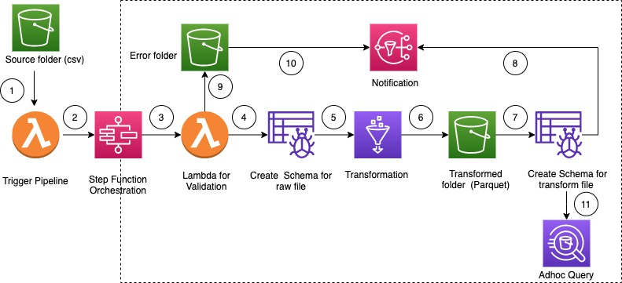
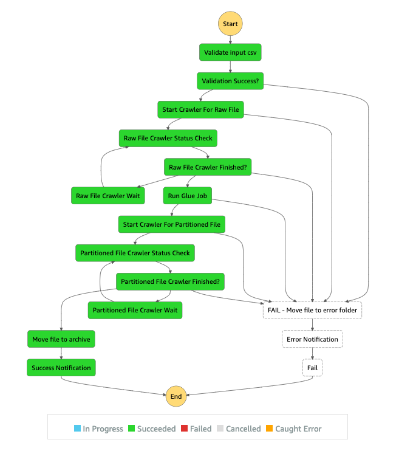

# Writing a Sample

** Version 1.0.0 **

This pattern explain how to build a serverless  ETL pipeline to validate, transform, compress, 
and partition large csv dataset for performance and cost optimization. 
The pipeline is orchestrated by serverless AWS Step Functions with error handling, retry and end user notification.
When a csv file is uploaded to AWS S3 (Simple Storage Service) Bucket source folder, ETL pipeline is triggered. 
The pipeline validates the content and the schema of the source csv file, transform csv file to compressed parquet format, 
partition the dataset with year/month/day  and store in a transformed folder for  analytics tools to consume.

## Prerequisites 
Prerequisites 
An active AWS account with programmatic access
AWS CLI with AWS account configuration, so that you can create AWS resources by deploying cloudformation stack
Amazon S3 bucket 
CSV dataset with correct schema ( attached is a sample csv file with correct schema and data type)
Chrome web browser
AWS Glue console access
AWS Step Functions console access

## Limitations
AWS Step Functions:

Execution History: The maximum limit for keeping execution history logs is 90 days.
For more details refer: 
AWS Step Functions Limits Overview

## Product versions
Python 3 for AWS Lambda
AWS Glue version 2#

## Architecture

## High level work flow

User uploads a csv file 
AWS S3 Notification event tiggers a AWS Lambda function that starts the step function state machine
AWS Lambda function validates the schema and data type of the raw file
AWS Glue Crawler create the schema of the raw file and move the file to stage folder
AWS Glue job transform, compress and partition the raw file into Parquet format
AWS Glue job also move the file to transform folder.
AWS Glue Crawler create the schema from the transformed file . The Resulting Schema can be used by analytics job
AWS SNS sends succesful notification
File moved to error folder if validation fails
AWS SNS sends error notification for any error inside workflow
Amazon Athena can be used for any adhoc query on partitioned dataset. 

## Automation and scale
This pattern can be deployed through AWS Cloudformation. See the attachment for the Cloudformation template file.

Follow the below step to deploy this pattern using Cloudformation template

Download the attached file (ETL Pipeline Step Function Pattern.zip), extract and copy to a separate local directory
Navigate to the local directory
Update parameter.json file as follows
Update ParameterValue for pS3BucketName Parameter with unique bucket name. This bucket will be created to store all the dataset. As, S3 Bucket name is globally unique, provide a unique name.
Update ParameterValue for pEmailforNotification with a valid email address to receive success/error notification3.
Execute the following AWS CLI command with pre-configured AWS CLI profile 
aws cloudformation package --template-file template.yml --s3-bucket <existing_bucket_name_in_the_same_region> --output-template-file packaged.template --profile <Profile_Name>
aws cloudformation deploy --stack-name <stack_name> --template-file packaged.template  --parameter-overrides file://parameter.json --capabilities CAPABILITY_IAM --profile <Profile_Name>
Check the progress of Cloudformation stack deployment in console
Once, stack deployment is completed, navigate to source folder inside S3 bucket ( which was provided in Step 3a above)
Upload a sample csv file ( attached) to trigger the ETL Pipeline through AWS Step Functions.
Check the ETL pipeline status in the AWS Step Functions.
Once ETL pipeline completes, partitioned dataset will be available in transform folder inside S3 Bucket ( set in Step 3a)
Partitioned Table will be available in AWS Glue Catalog. 
Optionally, Amazon Athena can be used for adhoc query on the partitioned/transformed dataset

## Successful ETL pipeline execution

## ETL pipeline execution with input validation error
